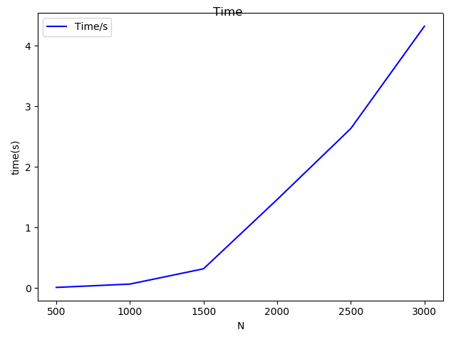

## Ex1_ Herbert Nguruwe

Implementation of  square matrix  multiplication code using OpenMP directive. I executed the code using the maximum available num of threads in Ulyses which is 20 cores. The value of N was  increased by a factor of 500  starting from 500 to 3000.  The obtained results  that are  in the [time.dat](data/time.data)  in the data folder. The file shows N, number of threads, time(μs),Peak performance(flops/sec).

The results obtained it can be noted that the time increases linearly with increase in N. The lowest time is when N is 1000 with only  0.067μs and the highest time achieved is when N is 3000 which is 4.325μs .This  is because when N is a 1000 data can be loaded in the cache memory which reduces the cache misses. Increase in the value of N means that we will have a lot of cache misses  and load data from RAM for multiplying.

The same trend can be seen for the peak performance is highest when  N is less than 1000  reaching almost 30 Gflop/s.If we  double the value of N  to 2000, we notice that the peak performance reduces to 10 Gflop/s  which is a factor of 3.  This is also due to the cache misses in  experienced when N  becomes high.

