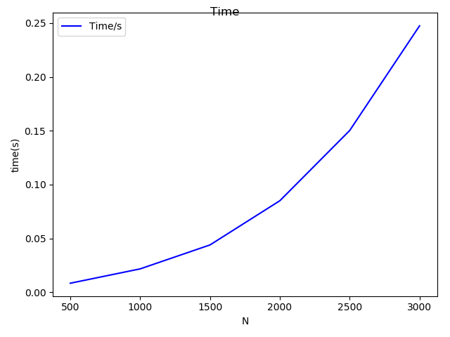

 ###  Herbert Nguruwe
 ## Matrix multiplication from PLASMA 

The exercise required that we implement a matrix multiplication using the PLASMA. The code of the implementation is available [here](code/plasma_dgemm.c).Original raw data is found [here](data/time.data) ,N is the size of the matrix, the time is in seconds, flops. The results are shown in the graph below.The time graph is as expected that it increase as N increases.

The number of Flops also increase with N, well possibly this might be because the Number of threads is the same for all computation meaning they might be the same commnication overhead. An increase in N will make us gain in the number of operations as overhead becomes less insignificant.