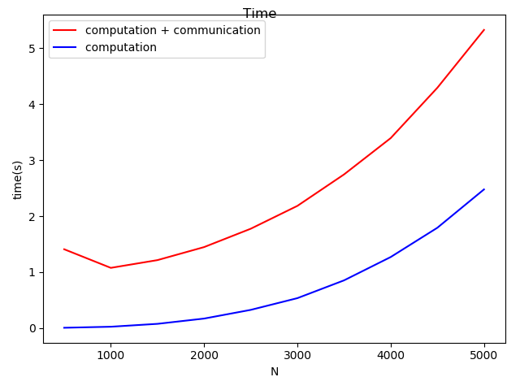

# Herbert Nguruwe
## Multiplication using magma_dgemm

In this execise I will implement magma_dgemm, using square matrix N for both matrice on intervals of   500 striding with 500 up to 5000.I ran two sets on compuattion 1 with communication and another without communication. The results of the expirement can be found with communication time [here](data/time.dat). In the table N is the size matrix,total time is communication + computation time,Flops per second using total time, t_comp is computational time and Flops is the flops per second for computational time.

The graph below shows the time in seconds. The execution that had communication took more time than the one that did not have  communication.I can note that there's quite a performance lose in transfering data.

With regards to flops we got the same behaviour, where I measured with communication time the Flops are less than without communication time. However the one with communication time shows the actual computational time. 

It can be noted that the performance and time(total time) to run increases with an increase of N however With lower values of N communication(overhead) time has a huge impact on the  total time. On the other hand for computational only we  the perfomance is very high and it reaches the platue. There is a huge perfomance in loss communication.

